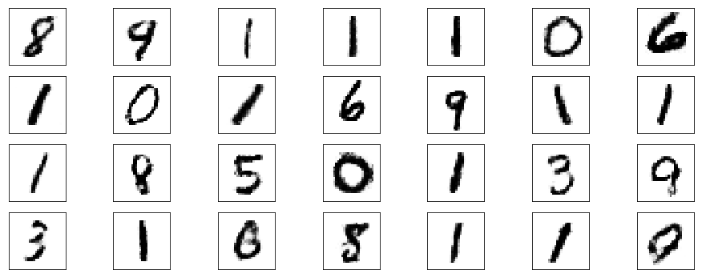
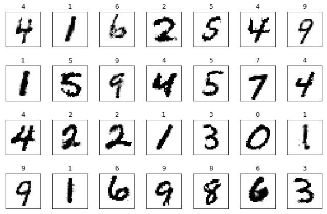
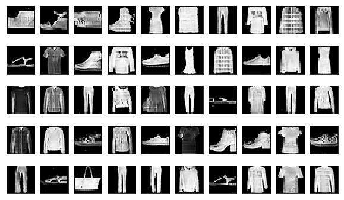
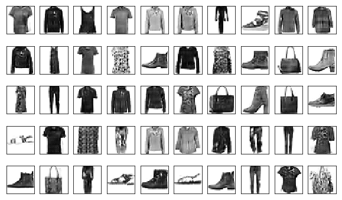
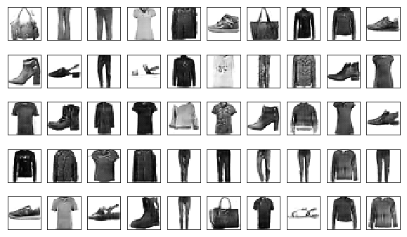

# gan-yhat
GAN implementations with PyTorch

The followings are a list of GAN implemented here.

1. Vanilla GAN
    - Vanilla GAN for MNIST
    - Vanilla GAN for Fashion MNIST
2. Conditional GAN for MNIST
3. DCGAN for Fashion MNIST
4. Improved GAN
    - Feature Maching 
5. AnoGAN

## Vanilla GAN

#### MNIST 

It shows a little bit of mode collapse; a commonly encountered failure case for GANs where the generator produces samples with extremely low variety. In this case, the generator produces `1` with extremely high probability. 

## Conditional GAN

Conditional GAN reduces mode collapse issue by giving the model additional information. 

## DCGAN

DCGAN makes use of convolutions and transposed convolutions. 

